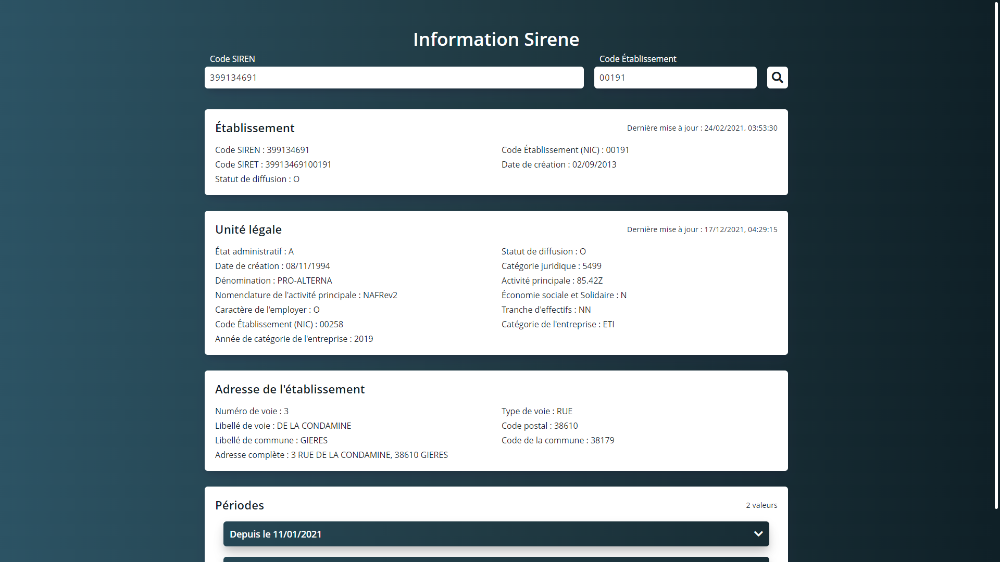

# Projet d'ERP
Création d'une page Web permettant d'afficher les informations d'un code SIREN et SIRET à partir de l'[API Sirene](https://api.gouv.fr/les-api/sirene_v3).  

## Technologies utilisées
* [VueJS](https://vuejs.org/)
* [Axios](https://axios-http.com/)
* [Fontawesome](https://fontawesome.com/)